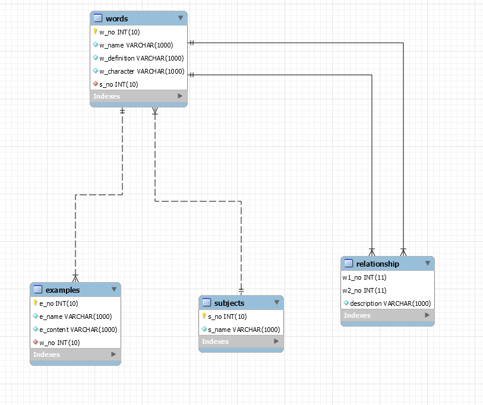

# Word_Mind2
* * *
## 단어 마인드맵 웹페이지
* * *
### 1. 기능 
 + 자신이 공부한 과목을 입력한다.
 + 그 과목의 단어들을 입력한다. 단어를 입력 시에 다른 단어들과의 관계도 입력한다.
 + 단어에 따른 예시들을 입력한다.
 + 과목, 단어, 예시는 수정과 삭제가 가능하다.
 + 마인드맵에서 단어를 클릭하면 단어의 세부내용이 담긴 새 창이 열린다.
 + 과목은 5각형, 단어는 다이아몬드, 예시는 원으로 
 * * *
### 2. 개발환경
 + Nodejs v12.14.0
 + Npm 6.13.4
 + Mysql 8.0.18 
* * *
### 3. DB
 
 * * *
### 4. 라이브러리
 + cytoscape (마인드 맵)
 * * *
### 5. 예시
 
